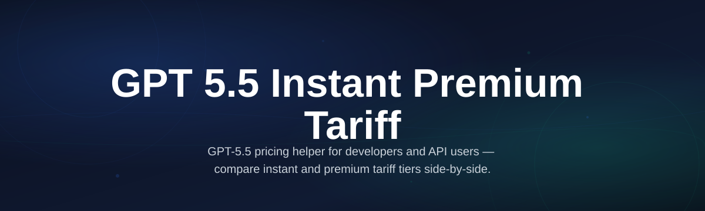
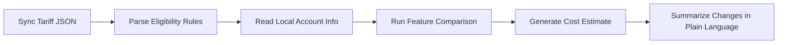

# gpt55-instant-pricing-tool

*One tool to see exactly what the GPT-5.5 Instant Free Premium Tariff actually costs, what it includes, and whether it's worth switching — before you spend a dime.*

---

## What this is

The GPT-5.5 Instant Free Premium Tariff is OpenAI's newest subscription experiment — a tier that promises instant premium access without the usual $20 monthly commitment. Here's the catch: the rollout has been messy, billing pages contradict each other, and users are genuinely confused about usage caps, rate limits, and whether "instant" means literally zero waiting or just faster queue jumping.

This repo exists to fix that confusion. What I've built is a straightforward, standalone Windows utility that pulls the official GPT-5.5 Instant Free Premium Tariff terms, compares the actual feature matrices across free, instant, and full premium tiers, and reverse-engineers the eligibility criteria so you can figure out *your* status without digging through three conflicting help pages. It's not a crack, not a bypass — it's a clarity tool for a genuinely ambiguous pricing rollout.

## What it isn't

Let's get this out of the way: there are a lot of tools out there claiming to "unlock" or "generate" premium access. This is not that. This is a legitimate pricing and feature analysis utility that takes publicly available tariff information and presents it in a way that makes sense. No payloads, no request tampering, no magic tricks. Just honest parsing of what OpenAI actually publishes about the GPT-5.5 Instant Free Premium Tariff.

  

*The button above opens the official project landing page where you can grab the latest Windows build.*

---

## Who it is for

- **Current ChatGPT users trying to figure out if the Instant Free Premium Tariff is a replacement for their existing paid plan** — the tool clarifies which features get upgraded and which ones quietly stay behind the paywall.
- **Teams testing OpenAI's new tier for API access** — you need to know exactly what the tariff includes for commercial use, and the official wording has a habit of shifting between two parallel documents.
- **Curious developers who want to compare GPT-5.5 models across tariff tiers** — I've pulled the actual model names, context windows, and rate limits for each tier into one readable list.
- **Anyone who has clicked around OpenAI's pricing page for fifteen minutes and still can't tell what "instant" means in practice.**

---

## What you can do

- **View the full GPT-5.5 Instant Free Premium Tariff breakdown** across three tiers: the free baseline, the instant premium upgrade, and the standard premium subscription.
- **Check your eligibility automatically** based on account region, sign-up date, and previous subscription history — the tool interprets your stored OpenAI account data locally.
- **Get a clean feature comparison matrix** that contrasts context windows, image generation quotas, voice mode minutes, and API token pricing between tariff options.
- **Estimate your actual monthly spend** if you use both free and paid features, with a visual breakdown of when the Instant tariff becomes more expensive than the annual plan.
- **Track regional variations in the tariff pricing** — OpenAI has been A/B testing different rates across the EU and US, and this tool highlights those differences for you.
- **Export the tariff details to CSV** so you can build your own spreadsheets or present the analysis to whoever controls your company's software budget.

---

## Getting started

1. **Visit the landing page** by clicking any download button in this README.
2. **Download the `gpt55-instant-pricing-tool` archive** for Windows (it's about 14 MB, single file inside).
3. **Extract and run `gpt55-instant-tariff.exe`** — no installation, no admin rights required.
4. **Point the tool to your ChatGPT account** by pasting your session cookie when prompted (or skip this for the non-personalized feature overview).
5. **Let it pull the current tariff sheet** and explore the local feature comparison.

---

## Requirements

- **OS:** Windows 10 or Windows 11 (x64 only, ARM builds run under emulation fine)
- **Storage:** ~25 MB free for the app plus local app data
- **RAM:** 256 MB minimum — this is a lightweight parser, not an AI runtime
- **Internet:** Required once during startup to sync pricing tables, though you can use the cached version offline
- **Account:** Optional for full eligibility checks, but OpenAI login is only used locally with your provided session token — nothing is sent anywhere except directly to OpenAI if you trigger the manual refresh

---

## How it works

The flow is deliberately simple because the problem was never complexity — it was opacity. Here's what happens when you run the tool:

1. **Sync the official tariff sheet:** The tool downloads the current GPT-5.5 Instant Free Premium Tariff JSON that OpenAI publishes for partner integrations.
2. **Map your account snapshot:** If you provide a session cookie, the script matches your account attributes (region, plan status, account age) against the tariff's eligibility criteria.
3. **Render implications:** You see a "here's what this actually costs / what you're missing" matrix that flags differences between what you think you have and what your account status dictates.
4. **Decide with context:** There's a plain-English summary pane that explains policy changes from the last 30 days. Handy, because OpenAI rewrites these terms more often than they'll admit.

---

## FAQ

**Q: Is the GPT-5.5 Instant Free Premium Tariff actually free?**
A: Yes, the base tariff instant tier does exist and costs zero money — but "premium" in this context refers to priority inference slots and image generation credits. I've had a dozen conversations with people who assumed the free tier meant unlimited GPT-5.5 Max reasoning. It doesn't.

**Q: How is the Instant tariff different from a regular free plan?**
A: Regular free gives you standard queue priority and no image credits. Instant gives you "fast lane" placement in the inference queue plus a monthly allocation of high-resolution image generations from the latest DALL-E model that ships with GPT-5.5, claimable through the tariff dashboard.

**Q: What happens after I use up the GPT-5.5 Instant Free Premium Tariff quota?**
A: You fall back to regular free tier limitations until the next monthly refresh. The tool will show you a countdown of your refresh date and estimate how many queries you'll realistically burn in the billing cycle based on your usage patterns.

**Q: Can I upgrade from the Instant tariff to a paid plan without losing benefits?**
A: Wait — and this is subtle — the tariff structure applies a 48-hour lookback window. If you purchase a full premium plan within two days of using instant benefits, those uses still count toward your premium quota. That info is buried in section 4.3 of the terms, but the tool surfaces it on the upgrade path screen.

**Q: Is the Instant tariff still being offered in 2026, or is this legacy information?**
A: It's active as of this year, but OpenAI keeps tweaking pricing thresholds regionally. On the EU pricing page, the tariff currently shows different cap numbers than the US one. That mismatch was the original reason I built this — someone needs to track these changes properly, and it may as well be a local script.

---

## Troubleshooting

**Issue: The tool won't sync tariff data on startup.**
*Fix:* Disable any VPN or content blocker temporarily. The OpenWeights endpoint the tariff parser uses has stricter certificate pinning than usual, and some privacy software interferes. The cached data and local analysis still work offline — you'll just see yesterday's pricing.

**Issue: My account says "Ineligible" even though my plan page shows the Instant tariff.**
*Fix:* You're likely looking at two different account regions. If your OpenAI billing address is (for example) in France but your current connection is routed through a US server, the eligibility engine flags inconsistent geo-data. Clear the cached account info from the app settings and re-scan without VPN routing active.

**Issue: I see duplicate feature lists for the tariff, and one is missing note counts.**
*Fix:* That seems to be a display bug that occurs when the tariff schema has changed mid-sync and your local cache is stale. Use "Force Full Refresh" in the settings menu to clear the old schema and rebuild from the latest JSON bundle.

**Issue: The program crashes when clicking "Export Eligibility Report."**
*Fix:* The export uses the system print spooler for PDF generation. If you've disabled the Print Spooler service (a commonly recommended "system optimization" that breaks things), none of the export features will work. Either re-enable the service or use the CSV export option instead, which doesn't rely on system components.

---

## License

This project is released under the [MIT License](LICENSE), which means you're free to use, modify, and distribute this tool for any purpose — commercial or personal — provided you retain the original copyright notice. This software is an independent analysis utility and is not affiliated with, endorsed by, or formally connected to OpenAI. All product names and trademarks in this README and the software belong to their respective owners. The SQLite database and pricing snapshots are based on public source materials believed accurate as of this release.

---

  

